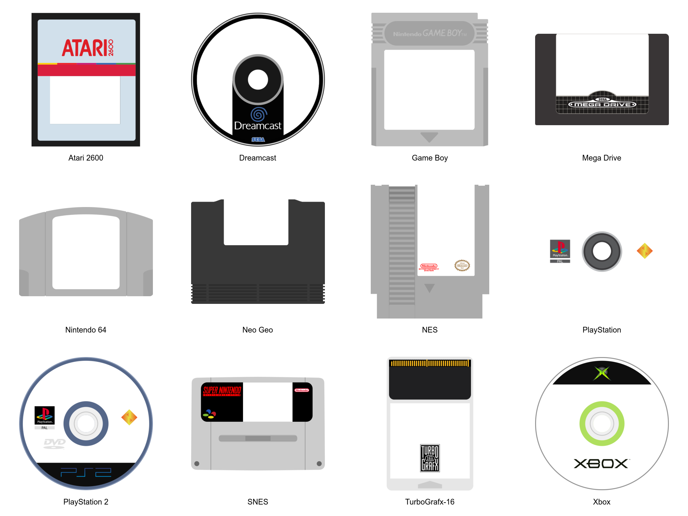

# Retro Media Overlay

  

A collection of transparent PNG overlays representing physical media from classic gaming systems.

These assets were adapted from community-created vector artwork, cleaned up, standardized, and rendered into high-quality transparent overlays suitable for frontend and media-library use.

## Features

* Transparent PNG overlays
* Cartridge, disc, tape and floppy formats
* Consistent visual style
* Frontend-ready assets
* Optimized for media compositing
* Based on community-created vector artwork

## Supported Platforms

### Nintendo

NES, SNES, Nintendo 64, Game Boy, Game Boy Color, Game Boy Advance, Nintendo DS, Nintendo 3DS, GameCube, Wii, Wii U, Virtual Boy

### Sega

Master System, Mega Drive / Genesis, Mega-CD, Saturn, Dreamcast

### Sony

PlayStation, PlayStation 2, PlayStation 3, PSP, PS Vita

### Atari

Atari 2600, Atari 7800, Atari Lynx

### SNK

Neo Geo, Neo Geo Pocket, Neo Geo Pocket Color

### NEC

TurboGrafx-16 / PC Engine

### Other Platforms

Commodore 64, WonderSwan, WonderSwan Color, Xbox, Xbox 360 and generic media formats.

## Usage

These overlays are intended to be composited over existing game artwork such as:

* Box art
* Covers
* Fan art
* Scraped media
* Theme artwork
* Frontend assets

## Attribution

This repository contains derivative artwork based on assets from the
Slate theme for ES-DE Frontend.

Original project:
https://gitlab.com/es-de/themes/slate-es-de

The original Slate assets are licensed under
CC BY-NC-SA 4.0.

Changes made in this repository include:

- Vector cleanup
- Shape correction
- Overlay adaptation
- Transparency preparation
- PNG rendering
- Visual standardization

Known contributors credited by the Slate project include:

- Bezza191
- Dan Patrick
- Recalbox contributors
- Carbon theme contributors

## License

Creative Commons Attribution-NonCommercial-ShareAlike 4.0 International (CC BY-NC-SA 4.0)

https://creativecommons.org/licenses/by-nc-sa/4.0/

## Disclaimer

All trademarks, logos, console names and product names belong to their respective owners.

This project is intended for preservation, customization and non-commercial community use.

## Support My Work
If you liked these overlays and helped you build your amazing front-end, consider buying me a coffee!

